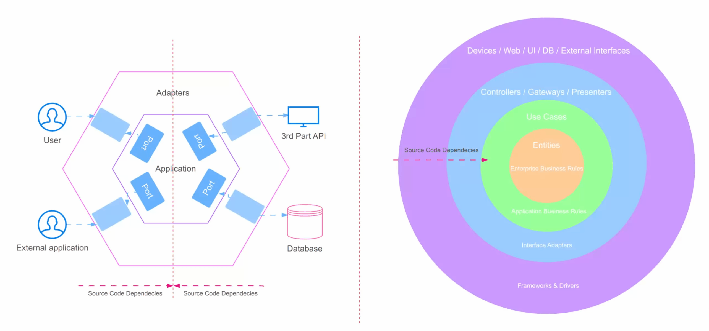

# Resume

SOLID Principles: The Bedrock of Clean, Maintainable Code

As software engineers, we strive for code that's robust, flexible, and easy to maintain.

Let's revisit SOLID principles - a set of guidelines that, when followed, lead to better software design.

Let's break them down:

𝗦 - 𝗦𝗶𝗻𝗴𝗹𝗲 𝗥𝗲𝘀𝗽𝗼𝗻𝘀𝗶𝗯𝗶𝗹𝗶𝘁𝘆 𝗣𝗿𝗶𝗻𝗰𝗶𝗽𝗹𝗲&#x20;

• Each class should have one, and only one, reason to change

&#x20;• Keep your code simple, focused, and easier to understand&#x20;

• Think: "Does this class do too much?"

𝗢 - 𝗢𝗽𝗲𝗻-𝗖𝗹𝗼𝘀𝗲𝗱 𝗣𝗿𝗶𝗻𝗰𝗶𝗽𝗹𝗲&#x20;

• Software entities should be open for extension, but closed for modification&#x20;

• Add new features without altering existing code&#x20;

• Use abstractions and polymorphism to achieve this

𝗟 - 𝗟𝗶𝘀𝗸𝗼𝘃 𝗦𝘂𝗯𝘀𝘁𝗶𝘁𝘂𝘁𝗶𝗼𝗻 𝗣𝗿𝗶𝗻𝗰𝗶𝗽𝗹𝗲&#x20;

• Derived classes must be substitutable for their base classes&#x20;

• Subclasses should extend, not replace, the behavior of the base class&#x20;

• Ensures different parts of your code can work together seamlessly

𝗜 - 𝗜𝗻𝘁𝗲𝗿𝗳𝗮𝗰𝗲 𝗦𝗲𝗴𝗿𝗲𝗴𝗮𝘁𝗶𝗼𝗻 𝗣𝗿𝗶𝗻𝗰𝗶𝗽𝗹𝗲&#x20;

• Many client-specific interfaces are better than one general-purpose interface&#x20;

• Keep interfaces focused and lean&#x20;

• Prevents classes from implementing methods they don't need

𝗗 - 𝗗𝗲𝗽𝗲𝗻𝗱𝗲𝗻𝗰𝘆 𝗜𝗻𝘃𝗲𝗿𝘀𝗶𝗼𝗻 𝗣𝗿𝗶𝗻𝗰𝗶𝗽𝗹𝗲&#x20;

• Depend on abstractions, not concretions&#x20;

• High-level modules shouldn't depend on low-level modules; both should depend on abstractions&#x20;

• Promotes flexibility and easier testing through decoupling

Implementing SOLID principles might seem challenging at first, but the long-term benefits are substantial:&#x20;

• Increased code maintainability&#x20;

• Easier testing and debugging&#x20;

• Enhanced scalability and flexibility

<figure><figcaption></figcaption></figure>
